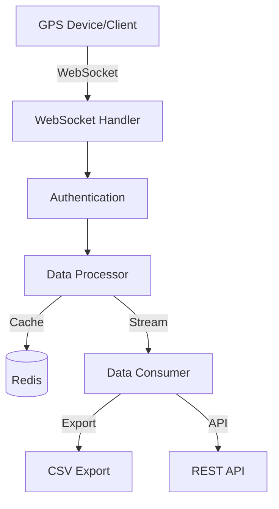

# Nomad

A modern, real-time GPS tracking platform that handles streaming location data with elegance and reliability. Built with Spring Boot and WebSocket technology, Nomad provides seamless real-time tracking capabilities with Redis-powered data persistence.

## Architecture Overview



The platform utilizes a microservices architecture with the following components:
- WebSocket server for real-time data streaming
- Redis for high-performance data caching and persistence
- Spring Security for authentication and authorization
- REST API for data export and management
- Scheduled tasks for data maintenance

## Features

- Real-time GPS data streaming via WebSockets
- Redis caching with 7-day data retention
- CSV export functionality (on-demand and scheduled)
- Device authentication
- Basic security for API endpoints
- Configurable data retention policies
- Batch export capabilities
- Real-time data validation
- Error handling and retry mechanisms

## Prerequisites

### Option 1: Running with Docker (Recommended)
- Docker (20.10.x or higher)
- Docker Compose (2.x or higher)
- 2GB RAM minimum
- 10GB free disk space

### Option 2: Running Locally
- Java 11
- Maven 3.6+
- Redis server running on localhost:6379
- 4GB RAM minimum
- 20GB free disk space

## Project Structure

```
nomad/
├── src/main/
│   ├── java/com/gpstracker/
│   │   ├── config/          # Configuration classes
│   │   ├── controller/      # REST endpoints
│   │   ├── model/          # Data models
│   │   ├── service/        # Business logic
│   │   └── websocket/      # WebSocket handlers
│   └── resources/
│       ├── application.properties  # App configuration
│       └── templates/      # HTML templates
├── docker-compose.yml      # Docker configuration
└── pom.xml                # Maven dependencies
```

## Running the Application

### Using Docker (Recommended)

1. Clone the repository:
```bash
git clone https://github.com/yourusername/nomad.git
cd nomad
```

2. Build and start the services:
```bash
docker-compose up --build
```

This will start both the Spring Boot application and Redis server. The application will be available at http://localhost:8080.

To stop the services:
```bash
docker-compose down
```

### Running Locally

1. Start Redis server

2. Build the application:
```bash
mvn clean install
```

3. Run the application:
```bash
mvn spring-boot:run
```

## API Documentation

### WebSocket Endpoints

#### GPS Data Stream
- URL: `ws://localhost:8080/gps`
- Authentication: Device ID (query param or header)
- Message Format: JSON

### REST Endpoints

#### Export GPS Data
- Method: GET
- URL: `/api/gps/export`
- Auth: Basic Authentication
- Parameters:
  - deviceId (required): Device identifier
  - startTime (required): Start timestamp (ISO-8601)
  - endTime (required): End timestamp (ISO-8601)
  - format (optional): "csv" or "json" (default: "csv")

## Security

### Authentication
- WebSocket connections require valid device IDs
- REST API endpoints use Basic Authentication
- Custom authentication can be configured in SecurityConfig.java

### Best Practices
1. Change default admin credentials
2. Use HTTPS in production
3. Implement rate limiting
4. Enable audit logging
5. Regular security updates
6. Use strong password policies

### Configuration

The main configuration properties in `application.properties`:

```properties
# Server Configuration
server.port=8080
server.ssl.enabled=false  # Enable in production

# Redis Configuration
spring.redis.host=localhost
spring.redis.port=6379
spring.redis.password=  # Set in production

# WebSocket Configuration
websocket.allowed-origins=*  # Restrict in production

# Security
spring.security.user.name=admin  # Change in production
spring.security.user.password=admin  # Change in production

# Logging
logging.level.com.gpstracker=DEBUG

# OpenWeatherMap API Key
openweathermap.api.key=YOUR_API_KEY
```

## Error Handling

Common errors and solutions:

1. WebSocket Connection Failed
   - Verify device ID is provided
   - Check network connectivity
   - Ensure server is running

2. Redis Connection Issues
   - Verify Redis is running
   - Check connection settings
   - Ensure sufficient memory

3. Export Failures
   - Validate date range
   - Check disk space
   - Verify file permissions

## Production Deployment

### Recommendations

1. Infrastructure
   - Use container orchestration (Kubernetes/ECS)
   - Implement load balancing
   - Set up monitoring and alerting

2. Security
   - Enable HTTPS
   - Use environment variables for secrets
   - Implement proper authentication
   - Set up firewalls

3. Performance
   - Configure JVM memory settings
   - Optimize Redis configuration
   - Enable compression
   - Use CDN for static content

### Monitoring
- JVM metrics
- Redis metrics
- WebSocket connections
- System resources
- Error rates

## Contributing

1. Fork the repository
2. Create a feature branch
3. Implement changes
4. Add tests
5. Submit pull request
6. Follow coding standards:
   - Use Java code style
   - Write documentation
   - Include unit tests
   - Follow commit message conventions

## Testing

### WebSocket Testing
```bash
# Install websocat
websocat ws://localhost:8080/gps?deviceId=device123

# Send test data
{"deviceId":"device123","latitude":37.7749,"longitude":-122.4194,"speed":30.5,"heading":180.0,"timestamp":"2023-12-25T10:30:00","additionalInfo":"Test data"}
```

### REST API Testing
```bash
# Export GPS data (Basic auth required)
curl -u admin:admin "http://localhost:8080/api/gps/export?deviceId=device123&startTime=2023-12-25T00:00:00&endTime=2023-12-25T23:59:59" -o export.csv
```

### Load Testing
```bash
# Using k6 for load testing
k6 run load-test.js
```

## Troubleshooting

1. Application Won't Start
   - Check Java version
   - Verify Redis connection
   - Review application logs
   - Check port availability
   - Verify OpenWeatherMap API key is provided

2. Redis Connection Issues
   - Verify Redis server is running
   - Check Redis connection settings in application.properties
   - Ensure Redis server is accessible from the application
   - Check Redis server logs for errors

3. Data Not Streaming
   - Verify WebSocket connection
   - Check device authentication
   - Monitor Redis memory
   - Review network settings

3. Export Issues
   - Validate date range format
   - Check file permissions
   - Verify available disk space
   - Review export service logs

## License

This project is licensed under the MIT License - see the LICENSE file for details.
